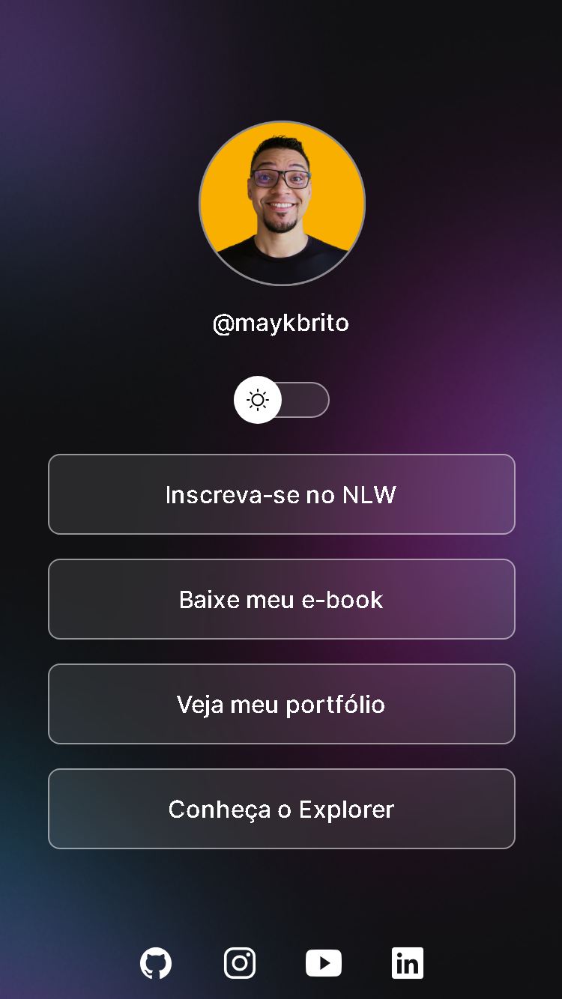
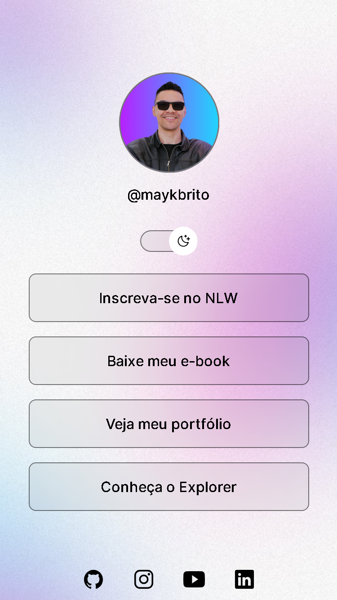

# Devlinks

  
  

## 💻 Projeto

Aplicação para exibir os links da rede social de alguma pessoa publica ou privada.

## 🤳 Veja o projeto

### Mobile

  
   

- Modo Dark

  

- Modo Light

  

### Desktop

### figma

[projeto do fimga](https://www.figma.com/community/file/1187422022288947321/devlinks-projeto-discover)

## 📝 Licença

Esse projeto está sob a licença MIT. Veja o arquivo [LICENSE](LICENSE) para mais detalhes.

---

<!--START_SECTION:footer-->

  

  
  

  

<!--END_SECTION:footer-->

  Feito com 💜 by Rocketseat

