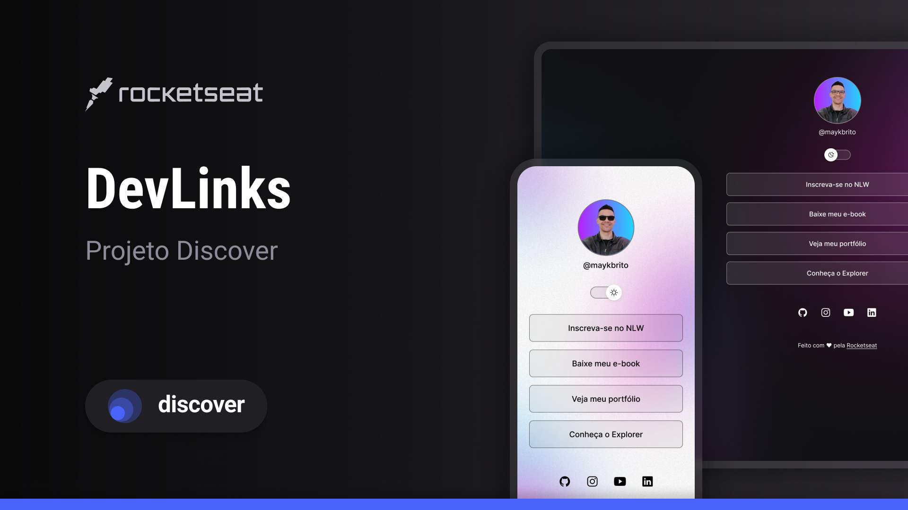

<h1 align="center"> DevLinks </h1>

  
  

  <a href="#-tecnologias">Tecnologias</a>|
  <a href="#-projeto">Projeto</a>|
  <a href="#memo-licença">Licença</a>

  

## 🚀 Tecnologias

Esse projeto foi desenvolvido com as seguintes tecnologias:

- HTML e CSS
- JavaScript
- Git e Github
- Figma

## 💻 Projeto

Aplicação para exibir os links da rede social de alguma pessoa publica ou privada.

### Mobile

  
   

### figma

[projeto do fimga](https://www.figma.com/community/file/1187422022288947321/devlinks-projeto-discover)

## 📝 Licença

Esse projeto está sob a licença MIT. Veja o arquivo [LICENSE](LICENSE) para mais detalhes.

---

<!--START_SECTION:footer-->

  

  
  

  

<!--END_SECTION:footer-->

  Feito com 💜 by Rocketseat

